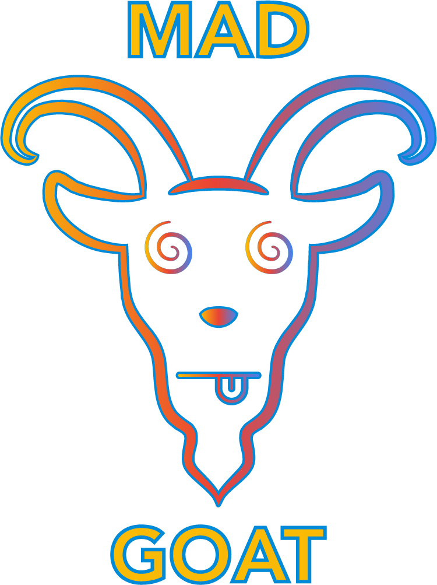

# MAD Goat Project

Making secure software is a complex task due to the ever-changing nature of technologies and software architectures. The
workforce behind software development must always be up to date on the latest trends and best practices of the industry.
With that comes security risks and, consequently, potential exploits that can be taken advantage of by malicious actors.

Relying on external tools like SAST or DAST can help companies to protect the software they produce. However, with the
increased complexity of software applications and associated approaches to their development, it becomes harder for
application security testing (AST) tools to discover vulnerabilities in a complete application.

A modern application can be constructed by a series of distinct building blocks, e.g., microservices, containerized
applications, and infrastructure as code. In today’s landscape, a single application can have dozens of independent
services communicating with one another, and the correlation between all these services can be hard to grasp for the AST
tools available in the market.

The main objective of the MAD Goat project is to develop a software application that takes into consideration all the
Modern Application Development building blocks and is vulnerable by nature to the security of these building blocks. The
developed application should serve as a security benchmark project to understand the quality of different security test
scanners. The MAD Goat application should also have an educational focus in its nature, providing its users the ability
to quickly learn about the main MAD vulnerabilities and how to mitigate them.

  

  

    Deliberately insecure web application. Truly MAD.
     
    <a href="https://github.com/MAD-Goat-Project/mad-web-app"><strong>Explore the docs »</strong></a>
     
     
    <a href="https://github.com/MAD-Goat-Project/mad-web-app">View Demo</a>
    ·
    <a href="https://github.com/MAD-Goat-Project/mad-web-app">Report Bug</a>
    ·
    <a href="https://github.com/MAD-Goat-Project/mad-web-app">Request Feature</a>
  

